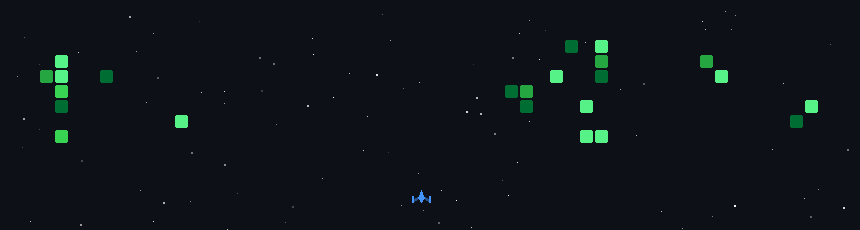

# Hey there, Nice to Meet yaa!! 👋

  
  
  

  

 

## 🙋‍♂️ About Me

<table>
  <tr>
    <td valign="top" width="55%">

🎓 **CS Student** passionate about turning ideas into real-world applications 

💻 **Web Developer** building with React, Java, and Machine Learning.

🚀 Interested in **Full-Stack Development**, **Machine Learning**, and **AI-powered applications**  

🌱 Always learning, always building — one project at a time.

⚡ Fun fact: I break things in code just to learn how to fix them better.

🧩 Enjoy solving problems that require logic, creativity, and persistence.

🔬 Experimenting with machine learning models and real-world datasets.

  </td>
  <td valign="top" width="45%">
    
  </td>
  </tr>
</table>

---

## 🛠️ Technologies I've Worked With

 

### 🌐 Frontend

### ⚙️ Backend

### 🗄️ Database

### 🤖 ML & AI

### 🔧 Tools

---

## 🚀 What I'm Working On

- 🔨 Building full-stack web apps using the **MERN stack**
- 🤖 Exploring **Machine Learning** models and integrating them into real applications
- 🧠 Deepening my understanding of **AI-powered** products and deployment
- 📚 Sharpening my **Data Structures & Algorithms** skills

---

## 🎮 GitHub Contributions — Space Shooter Edition

> *My contribution graph — but make it a space shooter 🚀*

---

## 📊 GitHub Stats

---

## 🏆 GitHub Trophies

---

## 😏 You know the feeling — you've been there.

 

&nbsp;&nbsp;&nbsp;&nbsp;

**☕ Coffee while working** &nbsp;&nbsp;&nbsp;&nbsp;&nbsp;&nbsp;&nbsp;&nbsp;&nbsp;&nbsp;&nbsp;&nbsp;&nbsp;&nbsp;&nbsp;&nbsp;&nbsp;&nbsp;&nbsp;&nbsp;&nbsp; **⌨️ Ultra Fast Typing** &nbsp;&nbsp;&nbsp;&nbsp;&nbsp;&nbsp;&nbsp;&nbsp;&nbsp;&nbsp;&nbsp;&nbsp;&nbsp;&nbsp;&nbsp;&nbsp;&nbsp;&nbsp;&nbsp;&nbsp;&nbsp; **🎯 Deep Focus**

 

&nbsp;&nbsp;
 
&nbsp;&nbsp;&nbsp;&nbsp;**🔁 Everything's a Copy** &nbsp;&nbsp;&nbsp;&nbsp;&nbsp;&nbsp;&nbsp;&nbsp;&nbsp;&nbsp;&nbsp;&nbsp;&nbsp;&nbsp;&nbsp;&nbsp;&nbsp;&nbsp;&nbsp;&nbsp;&nbsp;&nbsp;&nbsp;&nbsp; 
 
 
&nbsp;&nbsp;

**🧑‍💻 Junior Dev After Mistake** &nbsp;&nbsp;&nbsp;&nbsp;&nbsp;&nbsp;&nbsp;&nbsp;&nbsp;&nbsp;&nbsp;&nbsp;&nbsp;&nbsp;&nbsp; **😴 Sleepy Head**

 

&nbsp;&nbsp;&nbsp;&nbsp;

**⚔️ Conflict at Every PR** &nbsp;&nbsp;&nbsp;&nbsp;&nbsp;&nbsp;&nbsp;&nbsp;&nbsp;&nbsp;&nbsp;&nbsp;&nbsp;&nbsp;&nbsp;&nbsp;&nbsp;&nbsp;&nbsp;&nbsp;&nbsp;&nbsp;&nbsp;&nbsp; **😐 I Am Bored** &nbsp;&nbsp;&nbsp;&nbsp;&nbsp;&nbsp;&nbsp;&nbsp;&nbsp;&nbsp;&nbsp;&nbsp;&nbsp;&nbsp;&nbsp;&nbsp;&nbsp;&nbsp;&nbsp;&nbsp;&nbsp;&nbsp;&nbsp;&nbsp;&nbsp;&nbsp;&nbsp;&nbsp;&nbsp;&nbsp;&nbsp;&nbsp; **😤 Code Doesn't Work**

 

&nbsp;&nbsp;&nbsp;&nbsp;

**🤷 No Idea What I'm Doing** &nbsp;&nbsp;&nbsp;&nbsp;&nbsp;&nbsp;&nbsp;&nbsp;&nbsp;&nbsp;&nbsp;&nbsp;&nbsp;&nbsp;&nbsp;&nbsp;&nbsp;&nbsp; **🌗 Day Night** &nbsp;&nbsp;&nbsp;&nbsp;&nbsp;&nbsp;&nbsp;&nbsp;&nbsp;&nbsp;&nbsp;&nbsp;&nbsp;&nbsp;&nbsp;&nbsp;&nbsp;&nbsp;&nbsp;&nbsp;&nbsp;&nbsp;&nbsp;&nbsp;&nbsp;&nbsp;&nbsp;&nbsp;&nbsp;&nbsp;&nbsp;&nbsp;&nbsp;&nbsp;&nbsp; **🐛 Finding Big Bugs**

 

**😵 Work Pressure!!**

---

### 💬 Let's connect and build something amazing together!

